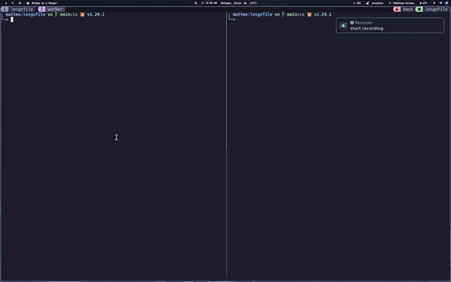
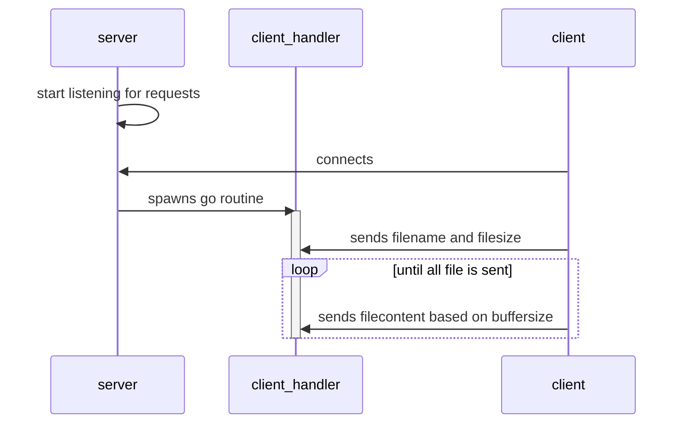
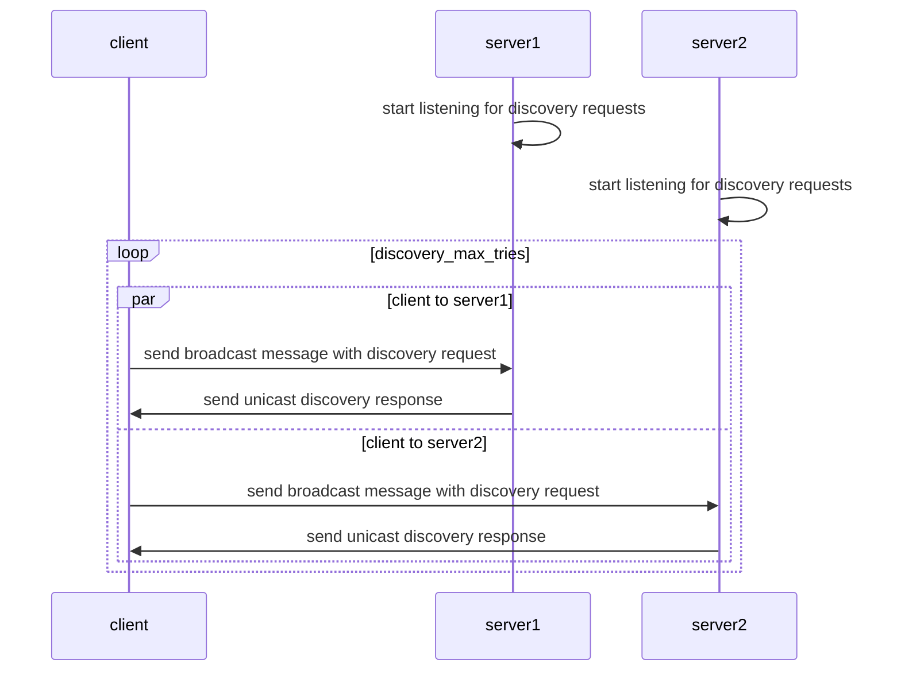
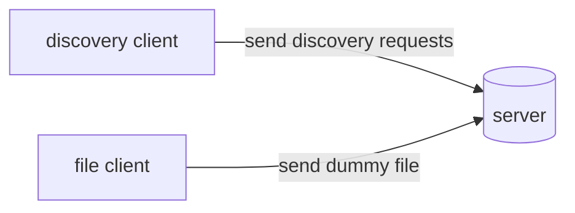

# Lesgofile 🗃️

Just a simple project to transfer file over network,



## Why this

I created this project with the scope of practice with some low level network programming and deployment automation techniques.
The project is distributed in multiple format as a single compiled binary using [goreleaser](https://goreleaser.com/)

## Features

- transfer file between clients (*obviously*)
- discovery features, server expose a UDP endpoint that can be contacted from the clients to discover available servers
- multiple deployment options supported thanks to goreleaser (*all modern distros and docker container*)
- client and server can be configured with a JSON file

## Installation:

Installation can be performed in 3 ways

### Compiled binaries

Download latest release from the [release page](https://github.com/carnivuth/lesgofile/releases/latest)

### As docker container

Lesgofile can be executed as a docker container, the default `CMD` runs the server component here an example of `docker-compose` file

```yaml
---
services:
  lesgofile:
    image: carnivuth/lesgofile:latest
```

To run the client side as a docker component pull the image and run the command inside it


### From source

- install the [go compiler](https://go.dev/doc/install)

- clone sources

```bash
git clone https://github.com/carnivuth/lesgofile
```

- build sources

```bash
cd lesgofile && go build
```

## Usage

The main binary file can act as server and client,

To run server:

```bash
lesgofile serve
```

To run client:

```bash
lesgofile send <server_address> filename
```

You can also pipe the file name to the lesgofile client:

```bash
echo "filename" | lesgofile send <address>
```

To search for servers in LAN using discovery feature:

```bash
lesgofile discover
```

It will print a list of discovered servers and the IP address.

## Developer documentation

### File server functionality

The file sending functionality is designed as a standard client server architecture with a multiple thread server that spawns one working process for client, the child process is implemented using go routines



### Discovery functionality

The discovery functionality is implemented using a UDP endpoint where server nodes listen for requests and sends a JSON encoded response to the client, the clients make broadcast requests to discover servers in the LAN




### Testing with docker

Lesgofile functionalities can be tested with docker simulating a client server scenario where a client sends a file to the server and then terminates and another client sends discovery requests



Here a docker compose sample to simulate the testing architecture

```yaml
---
services:

  # test discovery functionality
  lesgofile-discovery-user:
    build:
      dockerfile: ./Dockerfile
    command: /lesgofile discover
    depends_on:
      lesgofile-server:
        condition: service_started
        restart: true
    develop:
      watch:
        - path: .
          action: rebuild

  # test sending files functionality
  lesgofile-client:
    build:
      dockerfile: ./Dockerfile
    command: /lesgofile send lesgofile-server /lesgofile
    depends_on:
      lesgofile-server:
        condition: service_started
        restart: true
    develop:
      watch:
        - path: .
          action: rebuild

  # test main server
  lesgofile-server:
    build:
      dockerfile: ./Dockerfile
    develop:
      watch:
        - path: .
          action: rebuild
```
